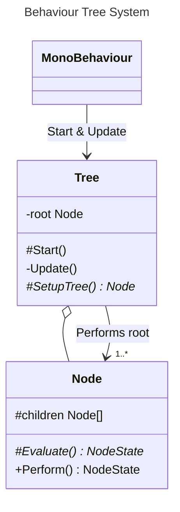

```mermaid
---
title: Behaviour Tree System
---

classDiagram
	Tree o-- Node
	Tree --> "1..*" Node : Performs root
	MonoBehaviour --> Tree : Start & Update

	class Node{
		#children Node[] 
		
		#Evaluate()* NodeState
		+Perform() NodeState
	}
	class Tree{
		-root Node 
		
		#Start() 
		-Update()
		#SetupTree()* Node
	}
	
	class MonoBehaviour{
	}
```
