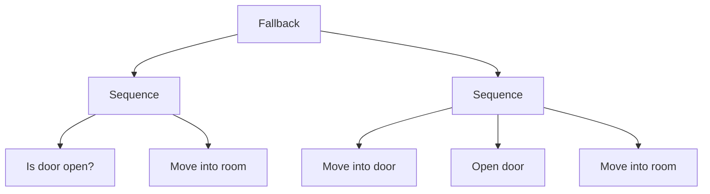
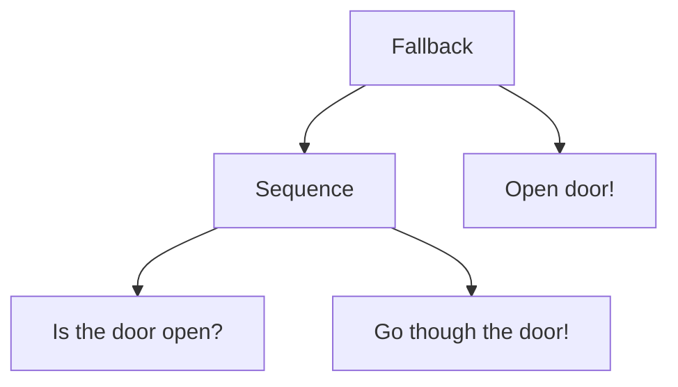

# The Tree
Behaviour Trees are a way of organizing complex systems of behaviour. They might be used for decision-making in video game NPCs and enemies. If you want to sound cool you might call behaviour trees, AI. 

They're called behaviour trees since they're commonly represented as something which resembles a tree, with out-going branches that derive from branches that derive from a root.




All the different components in the tree are called Nodes. There are different types of nodes, the nodes on the nodes on the bottom row which don't have and *children* below them are all called leafs or edges. While the ones with children are called composites.

# Nodes
Nodes can be evaluated (or executed), and must return one of three ("node")states: *Failure*, *Success* or *Running*. The root-node is special since it gets evaluated on a preset intervall, in video-games it's commonly once per frame, this will be important when we look at our first example. *NodeStates* is how Nodes are able to communicate with the nodes above them in the tree-structure. 

```cpp  
public enum NodeState { RUNNING, SUCCESS, FAILURE }
```

```cpp
public class Node  
{  
    protected List<Node> children;    
	
    internal Node(params Node[] children) {  
		this.children = new();  
		foreach (Node child in children)  
	    this.children.Add(child);  
    }   
	  
    protected virtual NodeState Evaluate() {
	    return NodeState.Failure; //gets overridden
    } 
    
	public NodeState PerformNode() => Evaluate(); 
}
```

Some nodes have children these are called *Composite Nodes*. These evaluate their children's 
`NodeState` results in some way and return their own `NodeState` based on those.

The *NodeStates* *Success* and *Failure* are don't have any implicit meaning but composite nodes interpret these in unique ways. While a returned "Running" says: "Hey, I'm performing an asynchronous task, please *evaluate* me again so that I can finish my task". Running also makes all of it's ancestors (parents) up to the root return *running* as well.

### Common Composite Nodes
#### Sequence
Executes children in order till one of them returns Failure or all return Success. The sequence composite returns failure if none of it's children do so or success if one of it's children returns success.

```cs
public class Sequence : Node {  
	public Sequence(params Node[] children) : base(children) { }  
	
	bool running = false;  
	int runningIndex = 0;  
	
	protected override NodeState Evaluate() {  
		for (int i = running ? runningIndex : 0; i < children.Count; i++) {  
			running = false;  
			switch (children[i].PerformNode()) {  
			case NodeState.SUCCESS:  
				continue;  
			case NodeState.FAILURE:  
				return NodeState.FAILURE;  
			case NodeState.RUNNING:  
		        running = true;  
		        runningIndex = i;  
		        return NodeState.RUNNING;  
		    default:  
		        return NodeState.SUCCESS;  
			}  
		}  
		return NodeState.SUCCESS;  
	}  
}
```

#### Fallback node
Sometimes referred to as *Selectors*. Executes all it's children till one of them returns success or all of them have returned failure. Fallback returns failure if all of it's children return failure, otherwise success.

```cs
public class Fallback : Node {  
    public Fallback(params Node[] children) : base(children) { }  
    
    bool running = false;    
    int runningIndex = 0;   
	
	protected override NodeState Evaluate() {    
		for (int i = running ? runningIndex : 0; i < children.Count; i++) {    
			running = false;    
			switch (children[i].PerformNode())  
	        {  
				case NodeState.SUCCESS:  
					return NodeState.SUCCESS;  
				case NodeState.FAILURE:  
					continue;  
				case NodeState.RUNNING:  
					running = true;    
					runningIndex = i;  
	                return NodeState.RUNNING;  
				default:  
		            continue;  
		    }   
		}    
		return NodeState.SUCCESS;    
	}    
}
```

#### Random
This composite is not necessarily a feature of every behaviour trees system. My implementation of the random composite executes only one of it's children, a randomized one or the node from the last time if it returned running. The random node itself return value mirrors the one of the selected child. The children also have weights attached to them which are used to make the more or less probable to get executed.

```cs
public class Random : Node {  
    private readonly Dictionary<Node, int> weightDict;  
	
    public Random(Dictionary<Node, int> childrenWithWeights) : base(childrenWithWeights.Keys.ToArray()) {  
		weightDict = children;  
    }  
	
    bool running = false;    
	int runningIndex = 0;  
	
    protected override NodeState Evaluate()  
    {  
		NodeState childReturnValue;  
		if (running) {  
	        childReturnValue = weightDict.ElementAt(runningIndex).Key.PerformNode();  
	        if (childReturnValue != NodeState.Running) {  
	            running = false;  
	        }  
	        return childReturnValue;  
	    }  
      
		int rand = UnityEngine.Random.Range(0, weightDict.Values.Sum());  
		int index = 0;  
		foreach (KeyValuePair<Node, int> entry in weightDict)  
		{  
			rand -= entry.Value;  
			if (rand < 0) {  
				break;  
			}  
			index++;  
		}  
  
		childReturnValue = weightDict.ElementAt(index).Key.PerformNode();  
		if (childReturnValue == NodeState.Running) {  
			runningIndex = index  
			running = true;  
		}  
	    return childReturnValue;  
    }  
}
```

### Decorators
A decorator is a composite node with merely one child by definition. Common ones are
(mainly 1-4):
1. Invert
	Takes child's returned NodeState and returns the opposite: Success becomes Failure and vice versa, while Running gives Running.
2. Retry
	Takes a number as an additional argument, the number is the amount of times that the child would be reevaluated, until the child returns a success. The retry-node mirrors the child's last response.
3. Repeat 
	Evaluates child x amount of times (evaluations returning running aren't counted). Returns mirror of child's last return value.
4. Timeout
	Constricts asynchronous tasks to a time-limit. Returns Failure if time-limit is reached otherwise mirrors child.
5. & 6. Force Success/Failure
	Evaluates child till it's not running. Returns Success/Failure, respectively, regardless of what the child's return value is.
7. & 8. Keep Running Until Success/Failure
	Keeps child running until success or failure respectively

### Edges/Leafs
While composite nodes are used to control the flow and logic of the tree, edges are used control-statements and actions. 

An example statement could be "Is the door open?", which could be true, the door is open, or false, it's closed. Success symbolizes true, and Failure false. 

Actions are things that happen, for instance following up on "Is the door open?", a good response to that being true might be to "Go though the door!".

# A tree in practice
Combining our knowledge so far we'll be able to look at an example. Remember how the root node gets evaluated on a time intervall, now that will be important to keep in mind.


This might be overwhelming at first but we'll start of by defining our goal, which is to make our way through a door. We start at the Fallback which leads us down to the Sequence which evaluates "Is the door open?", if it is then the Sequence continues to execute it's children in order resulting in the action "Go though the door!". The second scenario where "Is the door open?" evaluates Failure is more tricky. in this scenario the Sequence also returns Failure and the Fallback goes on to "Open door!". Now this tree has a root node that happens to be evaluated every 3 seconds.  So the next time around the door will be open and we end up like we did in scenario 1. Yay, we've made our way through the door!

# Sources:
- Auryn Robotics. (n.d.). *Decorators*. Retrieved 2024-05-09 from https://www.behaviortree.dev/docs/nodes-library/decoratornode/
- Robohub. (2021). *Introduction to behavior trees*. Retrieved 2024-05-09 from https://robohub.org/introduction-to-behavior-trees/
